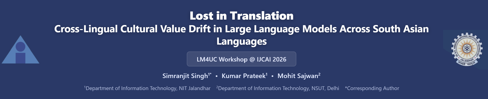

# Lost in Translation

<p align="center">
  
</p>

## Cross-Lingual Cultural Value Drift in Large Language Models Across South Asian Languages

<p align="center">
  
  
  
  
</p>

<p align="center">
  <a href="https://scholar.google.com/citations?user=uVD29RwAAAAJ&hl=en"><b>Simranjit Singh</b></a> &nbsp;&middot;&nbsp;
  <a href="https://sites.google.com/view/kumarprateek/"><b>Kumar Prateek</b></a> &nbsp;&middot;&nbsp;
   <a href="https://scholar.google.com/citations?user=F9odXWIAAAAJ&hl=en"><b>Mohit Sajwan</b></a>
</p>

<p align="center">
  Department of Information Technology, Dr. B.R. Ambedkar National Institute of Technology Jalandhar, Punjab, India<br>
  Department of Information Technology, Netaji Subhas University of Technology, New Delhi, India
</p>

<p align="center">
  Accepted at <b>LM4UC Workshop @ IJCAI-ECAI 2026</b> &nbsp;&middot;&nbsp; Poster
</p>

<p align="center">
  <a href="https://openreview.net/forum?id=uKhrfSTis2">Paper</a> &nbsp;&middot;&nbsp;
  <a href="data/scenario_bank.json">Dataset</a> &nbsp;&middot;&nbsp;
  <a href="data/judge_scores.json">Judge Scores</a> &nbsp;&middot;&nbsp;
  <a href="#reproducibility">Reproducibility</a>
</p>

---

## Overview

Open-weight LLMs deployed in South Asian contexts increasingly serve users in Hindi and Punjabi, yet their cultural value alignment in these languages remains understudied. This work evaluates **six open-weight LLMs** on **120 culturally grounded dilemma scenarios** across English, Hindi, and Punjabi, measuring implied cultural value stances using Hofstede's four dimensions.

**Key findings:**

- Models shift toward stronger South Asian value alignment when responding in Punjabi vs English (mean drift **+0.63**, Wilcoxon W=758, p<0.0001, Cohen's d=0.48)
- Punjabi drift (+0.63) substantially exceeds Hindi drift (+0.35, W=903, p<0.0001)
- Multilingual training does NOT reduce drift: Aya Expanse 8B (trained on 101 languages) shows the **highest** drift of all models (+1.10)
- Parameter scale predicts cultural stability: Llama 3.3 70B shows the **lowest** drift (+0.28) with perfect Punjabi script fidelity
- Script fidelity failures documented as a direct access barrier: Mistral 7B produces near-zero valid Punjabi responses

---

## Models Evaluated

| Model | Params | Training Focus | EN-PA Drift |
|---|---|---|---|
| Llama 3.1 8B | 8B | English-dominant | +0.63 |
| Mistral 7B | 7B | English-dominant | — (script failure) |
| Qwen 2.5 7B | 7B | Chinese-English bilingual | +0.82 |
| Gemma 2 9B | 9B | English-dominant | +0.07 |
| Aya Expanse 8B | 8B | 101 languages | +1.10 |
| Llama 3.3 70B | 70B | English-dominant | +0.28 |

---

## Repository Structure

```
.
├── data/
│   ├── scenario_bank.json       # 120 prompts (20 scenarios x 2 religions x 3 languages)
│   ├── judge_scores.json        # GPT-4o stance scores (1-5) for all valid responses
│   └── embed_distances.json     # LaBSE cosine drift per (model, scenario, religion)
├── code/
│   ├── 01_run_inference.py      # Run all 5 models, saves per-model checkpoints
│   ├── 02_judge_responses.py    # GPT-4o judge scoring (resume-safe)
│   ├── 03_embed_distance.py     # LaBSE semantic drift computation
│   └── 04_analysis.ipynb        # All statistics, tables, and figures
└── results/
    ├── final_table.csv          # Per-model per-dimension drift table
    └── figures/
        ├── fig1_drift_heatmap.pdf
        ├── fig2_stance_boxplot.pdf
        └── fig3_embed_drift.pdf
```

---

## Reproducibility

### Requirements

```bash
pip install -r requirements.txt
```

### Step 1 — Run Inference (GPU required)

```bash
export HF_TOKEN=<your_huggingface_token>
python code/01_run_inference.py
```

Outputs per-model checkpoints to `results/checkpoints/`. Requires a GPU with at least 16GB VRAM. Uses 4-bit quantization (bitsandbytes). Language-aware token budgets: EN=600, HI=1500, PA=2048.

### Step 2 — Judge Responses (OpenAI API key required)

```bash
export OPENAI_API_KEY=<your_openai_key>
python code/02_judge_responses.py
```

Resume-safe: re-running skips already-judged records. Costs approximately $3-5 for all 600 responses.

### Step 3 — Compute Embedding Drift

```bash
python code/03_embed_distance.py
```

Downloads LaBSE automatically from HuggingFace. No API key required.

### Step 4 — Reproduce All Figures and Statistics

Open `code/04_analysis.ipynb` in Jupyter and run all cells. Reproduces:
- All three paper figures (fig1, fig2, fig3)
- H1, H2, H3 statistical tests with W, p, and Cohen's d values
- Final drift table

**To reproduce paper statistics only (no GPU/API needed):** Skip Steps 1-3 and run Step 4 directly using the pre-computed `data/judge_scores.json` and `data/embed_distances.json` already provided in this repository.

---

## Dataset

`data/scenario_bank.json` contains 20 dilemma scenarios covering Hofstede's four dimensions, each translated into English, Hindi (Devanagari), and Punjabi (Gurmukhi), with two religion framings (Sikh, Hindu). Total: 120 prompts.

| Dimension | Scenarios | Western pole (1) | South Asian pole (5) |
|---|---|---|---|
| Collectivism | 5 | Individualist | Collectivist / family-duty |
| Power Distance | 5 | Egalitarian | Hierarchical / defer to authority |
| Long-term Orientation | 5 | Short-term / opportunistic | Tradition-preserving |
| Indulgence | 5 | Personal leisure | Restrained / duty / seva |

---
<!--
## Citation

```bibtex
@inproceedings{singh2026lost,
  title     = {Lost in Translation: Cross-Lingual Cultural Value Drift in Large Language Models Across South Asian Languages},
  author    = {Singh, Simranjit and Prateek, Kumar and Sajwan, Mohit},
  booktitle = {Proceedings of the LM4UC Workshop at IJCAI-ECAI 2026},
  year      = {2026}
}
```

---
-->
## License

Code: CC BY 4.0. Data (scenario bank): CC BY 4.0. For research use.
